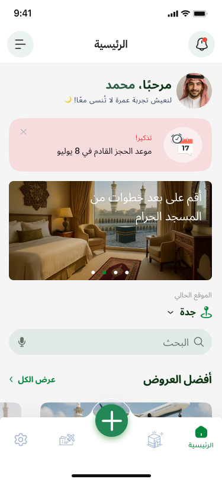
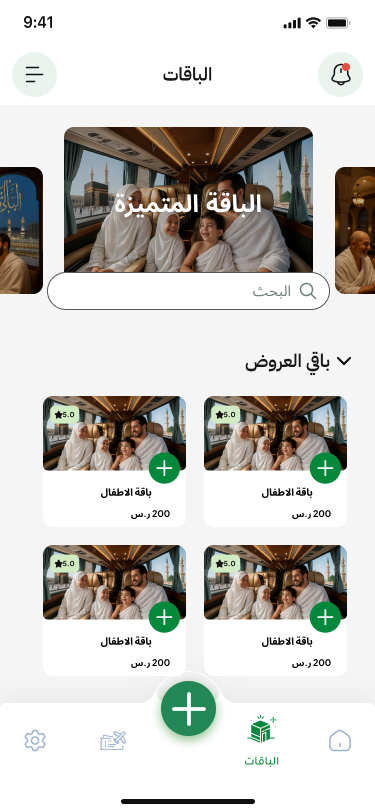

# Hajaj

A mobile application developed for booking Umrah tickets and domestic trips. It provides a seamless experience for users to manage their travel itineraries with a focus on clean UI/UX and reliable performance.

## 📱 Screenshots
|  |  | ||
 

## ✨ Features

*   **Umrah & Trip Booking:** Comprehensive booking system for Umrah and domestic travel.
*   **Secure Payments:** Integrated **ClickPay** for secure online transactions.
*   **Itinerary Management:** User-friendly booking flow and itinerary management.
*   **High Performance:** Clean UI/UX design ensuring reliable app performance.

